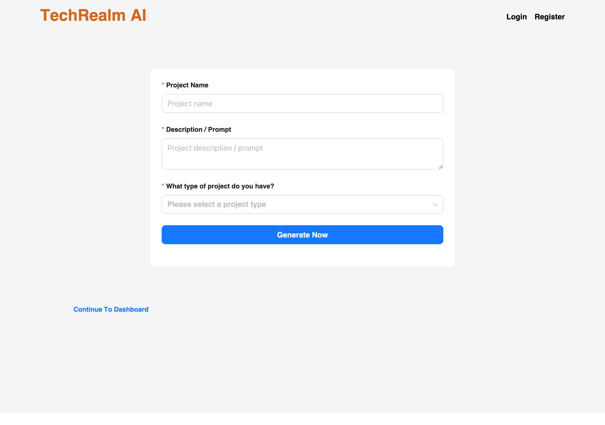
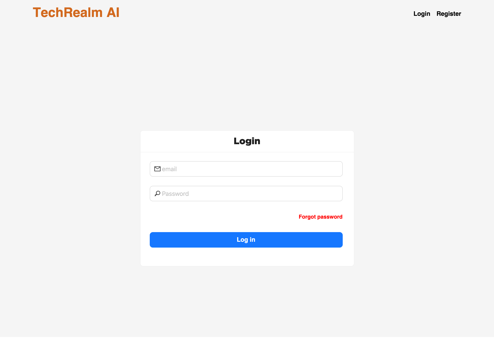
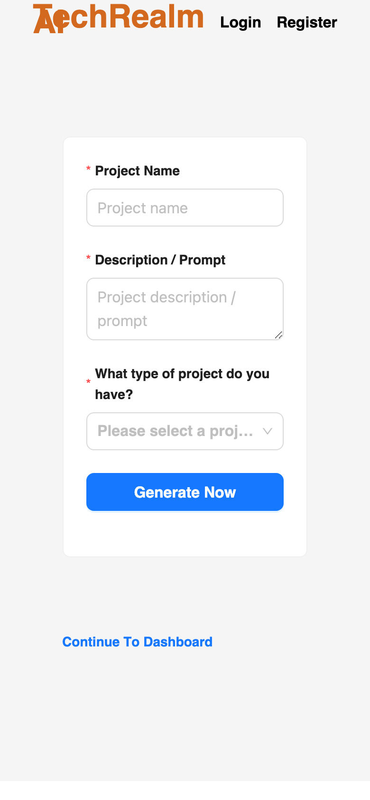

# TechRealm AI — Project Dashboard

> Describe an idea, pick a project type, hit **Generate Now**, and let TechRealm AI shepherd it from a one-line prompt to a tracked, sharable project. A tidy Next.js dashboard for turning "wouldn't it be cool if…" into an actual to-do list.

<p align="center">
  
</p>

This is the **frontend** for the TechRealm AI product: a Next.js 13 (pages router) dashboard built with [Ant Design](https://ant.design/), Redux Toolkit, and a token-based auth flow. You bring the prompt; it handles the accounts, the project cards, and the paperwork.

---

## What's inside

- **Prompt-to-project form** — name it, describe it, pick a type, and it spins up a project record.
- **Full auth flow** — register, login, OTP verify, forgot / reset / set password. JWT stored client-side, attached to every request via an Axios interceptor.
- **Dashboard** — grid of your project cards, with an "Add New" shortcut and a per-project detail page.
- **Guest mode** — start a project without an account; the IDs ride along in `localStorage` until you sign up.
- **Role & permission scaffolding** — Redux slices for auth, roles, and permissions, ready for a gated backend.
- **Responsive by design** — the cards and forms reflow cleanly from a wide desktop down to a phone.

<p align="center">
  
  &nbsp;
  
</p>

---

## Tech stack

| Layer            | Tool                                   |
| ---------------- | -------------------------------------- |
| Framework        | Next.js 13 (pages router)              |
| UI kit           | Ant Design 5 + `@ant-design/icons`     |
| State            | Redux Toolkit + React-Redux            |
| Networking       | Axios (with a Bearer-token interceptor)|
| Auth tokens      | `jwt-decode`, client session helper    |
| Nice touches     | NProgress route loader, self-hosted fonts |
| Deploy           | PM2 + a GitHub Actions SSH deploy step |

---

## Get it running (beginner-friendly, promise)

You'll need **Node.js 18 or newer** and a package manager. Any of `npm`, `yarn`, or `pnpm` works — the examples use `npm`.

**1. Grab the code**

```bash
git clone https://github.com/waleedsworld/client-techrealm-ai.git
cd client-techrealm-ai
```

**2. Install the dependencies**

```bash
npm install
```

**3. Point it at your API**

This app is the frontend half — it talks to a REST backend for auth and projects. Copy the example env file and set the base URL:

```bash
cp .env.example .env.local
```

```env
# .env.local
NEXT_PUBLIC_API_BASE=http://localhost:8000/api/v1
```

> No backend handy? The UI still boots and every page renders — the network calls just won't return data until an API is wired up. Great for design work and screenshots.

**4. Start the dev server**

```bash
npm run dev
```

Open **http://localhost:3000** and you're in. Live-reload is on, so edit and watch it update.

**5. Build for production**

```bash
npm run build   # compiles + type/lint checks
npm run start   # serves the production build
```

---

## Handy scripts

| Command              | What it does                               |
| -------------------- | ------------------------------------------ |
| `npm run dev`        | Dev server with hot reload                 |
| `npm run build`      | Production build (also runs lint checks)   |
| `npm run start`      | Serve the production build                 |
| `npm run lint`       | Next.js ESLint pass                        |
| `npm run format`     | Prettier the whole project                 |

**Linux + Husky gotcha:** if the pre-commit hook won't fire, make it executable:

```bash
chmod +x .husky/pre-commit
```

---

## Project layout

```
src/
├─ pages/            # routes: landing, auth flow, dashboard, project detail
│  ├─ dashboard/     # project grid + create + [link] detail
│  └─ _app / _document
├─ components/       # layouts, forms, shared table, project cards
├─ redux/            # store + auth / role / permission slices
├─ utilities/        # axios instance, request helper, session + jwt helpers
├─ middleware/       # WithAuth route guard
└─ styles/           # global CSS + self-hosted fonts
```

---

## Deploying

The included GitHub Actions workflow (`.github/workflows/deploy.yml`) SSHes into a server on push to `main`, pulls, installs, builds, and reloads the app via **PM2** (`ecosystem.config.js`). Wire up the `HOST`, `USERNAME`, `PORT`, `SSHKEY`, and `TARGET_PATH` repo secrets and it'll self-deploy.

**Live demo:** deploying soon.

---

## A note on privacy

Fonts are **self-hosted** from `public/fonts/` — no third-party font CDNs phoning home. The only data the app stores locally is your auth token and any guest project IDs.

---

Built with care by TechRealm. If it saves you five minutes of project-kickoff busywork, it's earning its keep.
